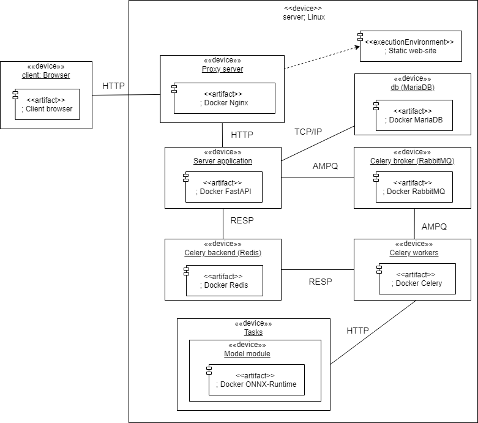

# Image generation with FastAPI and Vue.js 3.x
In this repo you can find how to use ONNX-Runtime docker with FastAPI (as backend)
and Vue.js (as frond-end). 

There are several main modules: 
- Celery broker aka `Celery broker (RabbitMQ)` (RabbitMQ), docker - rabbitmq;
- Celery backend aka `Celery backend (Redis)` (Redis), docker - redis;
- Celery worker aka `Celery workers` (Celery), docker - worker;
- model module aka `Model module` (ONNX-Runtime), docker - server_model;
- backend aka `Server application` (FastAPI), docker - server_backend;
- front-end aka `UserClient` (Vue.js), docker - web_module;

Each module is a docker with own settings and config file. 
You can observe `docker-compose.yml` file for more details.

Here is simple diagram for this system:

<p align="center"></p>

# How to start
## Simple solution (aka ***production*** )
Run docker-compose file `docker-compose.yml` with command:

```
docker-compose -f docker-compose.yml up
```

If you want test it locally - run docker as it is.
If you want to start ***real*** server, then you need to modify some variables:
- In `server/server_web/app.py`, on line 11, you should append 
your IP address with port of front-end (by default its 8080), aka `http://192.186.12.2:8080`
Thats it!

After that you need to open two ports: 8080 (for front-end) and 3117 (for backend).

## Hard solution (aka ***develope***)
For this case, you need start several things before application.

### Step 1. Start Celery broker and backend
First is to run broker (RabbitMQ) and backend (Redis):

- Redis:
`docker run -d -p 6379:6379 redis`

- RabbitMQ:
`docker run -d -p 5672:5672 rabbitmq`

### Step 2. Start Celery workers
After that, you need to start Celery itself.

Go to folder `server/server_web` and run workers with Celery:

Linux:

`celery -A routers.celery_task_app.worker worker -l info`

Windows:

`celery -A routers.celery_task_app.worker worker -l info -P gevent`

#### ***Problem with Celery on Windows***
##### ***Solution 1***
While trying to start Celery on windows, I have some problems with that,
but found some solution in the Internet
in order to start worker on Windows try next:

Install:
`pip install eventlet`

After that, Celery can be started via command:
`celery -A routers.celery_task_app.worker worker --pool=eventlet`

*but* there is some issue with this `eventlet`

##### ***Solution 2 (recommended)***

Instal: `pip install gevent`

Run Celery with command: `celery -A routers.celery_task_app.worker worker -l info -P gevent`

Tested on Windows 10

### Step 3. Start Server application
In folder `server/server_web` update your python environment with `requirements.txt` file:

`pip install -r requirements.txt`

In same folder run FastAPI server with command:

`uvicorn app:app --host 0.0.0.0 --port 3117`

### Step 4. Start UserClient
In folder `client`, run next command:

`npm run serve`

